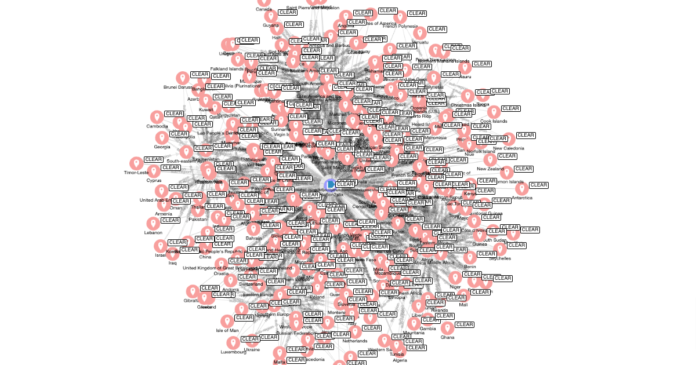

# location2stix

A command line tool that converts Countries and Regions into STIX 2.1 Location objects with rich relationships

## Before you begin

We host a full web API that includes all objects created by location2stix, [CTIButler](https://www.ctibutler.com/).

## Overview



The STIX Location object allows you to map location from country level all the way down to an exact address or latitude / longitude pair.

The problem is, many locations (e.g. a Country) are unique. The way Location SDOs are generated (using a random UUID v4) means that two different intelligence producers will create a STIX Location object with a different `id` for exactly the same place.

For intelligence reporting, there are times a specific address or lat/lon pair is used. However, more generally intelligence is reported at a regional or country level (e.g. North Korea actors targeting financial institutions in the United States).

This code is designed to map UN Regions, Groupings of Countries and Countries themselves as STIX objects so that they can be used freely by intelligence producers when working with location related intelligence.

We use ISO 3166 to generate this data, you can see this data in the `ISO-3166-Countries-with-Regional-Codes.csv` in the `input_data` directory of this repository.

## tl;dr

[](https://www.youtube.com/watch?v=lMmAi9FveC0)

[Watch the demo](https://www.youtube.com/watch?v=lMmAi9FveC0).

## Install the script

```shell
# clone the latest code
git clone https://github.com/muchdogesec/location2stix
# create a venv
cd location2stix
python3 -m venv location2stix-venv
source location2stix-venv/bin/activate
# install requirements
pip3 install -r requirements.txt
```

## Usage

```shell
python3 location2stix.py
```

You can see the current version of the bundle in `output/locations-bundle.json`
## STIX Mappings

### A note on the STIX2 filestore

This script uses the STIX2 Python libraries filestore feature.

All objects created are stored in the directory `stix2objects`.

On each run, this directory is deleted, and the object regenerated.

### Marking Definition / Identity

These are hard-coded and imported from our [stix4doge repository](https://github.com/muchdogesec/stix4doge). Specifically these objects;

* Marking Definition: https://raw.githubusercontent.com/muchdogesec/stix4doge/main/objects/marking-definition/location2stix.json
* Identity: https://raw.githubusercontent.com/muchdogesec/stix4doge/main/objects/identity/location2stix.json

### Country Level Data

Each country object is mapped to a STIX location object as follows;

```json
{
	"type": "location",
	"spec_version": "2.1",
	"id": "location--<UUID V5>",
	"created_by_ref": "identity--<IMPORTED IDENTITY>",
	"created": "2020-01-01T00:00:00.000Z",
	"modified": "2020-01-01T00:00:00.000Z",
	"name": "<name>",
	"region": "<CONVERTED SUBREGION>",
	"country": "<alpha-2>",
	"object_marking_refs": [
        "marking-definition--94868c89-83c2-464b-929b-a1a8aa3c8487",
        "<IMPORTED MARKING DEFINITION>"
    ],
    "external_references": [
        {
            "source_name": "type",
            "external_id": "<either county/region/sub-region/intermediate-region>"
        },
        {
            "source_name": "alpha-2",
            "external_id": "<alpha-2>"
        },
        {
            "source_name": "alpha-3",
            "external_id": "<alpha-3>"
        },
        {
            "source_name": "iso_3166-2",
            "external_id": "<iso_3166-2>"
        },
        {
            "source_name": "country-code",
            "external_id": "<country-code>"
        },
        {
            "source_name": "location2stix",
            "external_id": "<alpha-2>"
        }
    ]
}
```

The UUIDv5 is generated using the namespace `674a16c1-8b43-5c3e-8692-b3d8935e4903` with the `name`.

e.g. `674a16c1-8b43-5c3e-8692-b3d8935e4903` `France` = `location--4e9a8b79-6776-56e3-b72c-cb19a086b6a8`

`<CONVERTED SUBREGION>` must match entry from `region-ov`: https://docs.oasis-open.org/cti/stix/v2.1/os/stix-v2.1-os.html#_i1sw27qw1v0s. To turn the JSON response into a valid option in this list, the subregion value found in the csv file is first:

* made lower case
* any whitespaces replaced with `-`
* the string ` and` is removed

### Intermediate regions

For every distinct sub-region in the csv, a sub-region object is created

```json
{
	"type": "location",
	"spec_version": "2.1",
	"id": "location--<UUID V5>",
	"created_by_ref": "identity--<IMPORTED IDENTITY>",
	"created": "2020-01-01T00:00:00.000Z",
	"modified": "2020-01-01T00:00:00.000Z",
	"name": "<intermediate-region>",
	"region": "<CONVERTED intermediate-region>",
	"object_marking_refs": [
        "marking-definition--94868c89-83c2-464b-929b-a1a8aa3c8487",
        "<IMPORTED MARKING DEFINITION>"
    ],
    "external_references": [
        {
            "source_name": "intermediate-region-code",
            "external_id": "<intermediate-region-code>"
        },
        {
            "source_name": "location2stix",
            "external_id": "<CONVERTED intermediate-region>"
        }
    ]
}
```

The UUIDv5 is generated using the namespace `674a16c1-8b43-5c3e-8692-b3d8935e4903` with the `name`.

### Sub-regions

For every distinct sub-region in the csv, a sub-region object is created

```json
{
	"type": "location",
	"spec_version": "2.1",
	"id": "location--<UUID V5>",
	"created_by_ref": "identity--<IMPORTED IDENTITY>",
	"created": "2020-01-01T00:00:00.000Z",
	"modified": "2020-01-01T00:00:00.000Z",
	"name": "<sub-region>",
	"region": "<CONVERTED sub-region>",
	"object_marking_refs": [
        "marking-definition--94868c89-83c2-464b-929b-a1a8aa3c8487",
        "<IMPORTED MARKING DEFINITION>"
    ],
    "external_references": [
        {
            "source_name": "sub-region-code",
            "external_id": "<sub-region-code>"
        },
        {
            "source_name": "location2stix",
            "external_id": "<CONVERTED sub-region>"
        }
    ]
}
```

The UUIDv5 is generated using the namespace `674a16c1-8b43-5c3e-8692-b3d8935e4903` with the `name`.

### Region

```json
{
	"type": "location",
	"spec_version": "2.1",
	"id": "location--<UUID V5>",
	"created_by_ref": "identity--<IMPORTED IDENTITY>",
	"created": "2020-01-01T00:00:00.000Z",
	"modified": "2020-01-01T00:00:00.000Z",
	"name": "<region>",
	"region": "<CONVERTED region>",
	"object_marking_refs": [
        "marking-definition--94868c89-83c2-464b-929b-a1a8aa3c8487",
        "<IMPORTED MARKING DEFINITION>"
    ],
    "external_references": [
        {
            "source_name": "region-code",
            "external_id": "<region-code>"
        },
        {
            "source_name": "location2stix",
            "external_id": "<CONVERTED region>"
        }
    ]
}
```

### Relationships

1. Sub-regions (`source_ref`) have a relationship to a Regions (`target_ref`) (type: `region`)
2. Intermediate-regions (`source_ref`) have a relationship to Sub-regions (`target_ref`) (type: `sub-region`)
3. Countries (`source_ref`) have a relationship to a Sub-region (`target_ref`) (type: `sub-region`)
4. Countries (`source_ref`) have a relationship to a Region (`target_ref`) (type: `region`)
5. Countries (`source_ref`) have a relationship to a Intermediate-Region (`target_ref`) (type: `intermediate-region`)

<iframe width="768" height="432" src="https://miro.com/app/live-embed/uXjVKAj06DQ=/?moveToViewport=-653,-302,761,366&embedId=10658975368" frameborder="0" scrolling="no" allow="fullscreen; clipboard-read; clipboard-write" allowfullscreen></iframe>

For each of these relationships, a STIX SRO is created as follows

```json
{
    "type": "relationship",
    "spec_version": "2.1",
    "id": "relationship--<UUID V5>",
    "created_by_ref": "<IMPORTED IDENTITY>",
    "created": "2020-01-01T00:00:00.000Z",
    "modified": "2020-01-01T00:00:00.000Z",
    "description": "<SOURCE.NAME> belongs to the <TYPE> of <TARGET>",
    "relationship_type": "<TYPE>",
    "source_ref": "<SOURCE>",
    "target_ref": "<TARGET>",
    "object_marking_refs": [
        "marking-definition--94868c89-83c2-464b-929b-a1a8aa3c8487",
        "<IMPORTED MARKING DEFINITION>"
    ]
}
```

The UUIDv5 is generated using the namespace `674a16c1-8b43-5c3e-8692-b3d8935e4903` and `source_ref` + `target_ref`

e.g. `674a16c1-8b43-5c3e-8692-b3d8935e4903` `location--c42e841b-8ec7-422a-ac10-2704930291d4+location--a19a2293-6f58-435a-a41c-c8830e43eef4` == `relationship--725fcf9b-3e13-5990-8410-2ad7028437ba`

### Bundle

A bundle containing all objects is then created:

```json
{
    "type": "bundle",
    "id": "bundle--<UUID V5>",
    "objects": [
        "<ALL STIX OBJECTS>"
    ]
}
```

The UUIDv5 is generated using the namespace `674a16c1-8b43-5c3e-8692-b3d8935e4903` with the value being the MD5 has of all objects sorted in the bundle.

The name of the output bundle is `locations-bundle.json` and is stored in the `stix2objects` directory.

## Useful supporting tools

* To generate STIX 2.1 Objects: [stix2 Python Lib](https://stix2.readthedocs.io/en/latest/)
* The STIX 2.1 specification: [STIX 2.1 docs](https://docs.oasis-open.org/cti/stix/v2.1/stix-v2.1.html)

## Support

[Minimal support provided via the DOGESEC community](https://community.dogesec.com/).

## License

[Apache 2.0](/LICENSE).